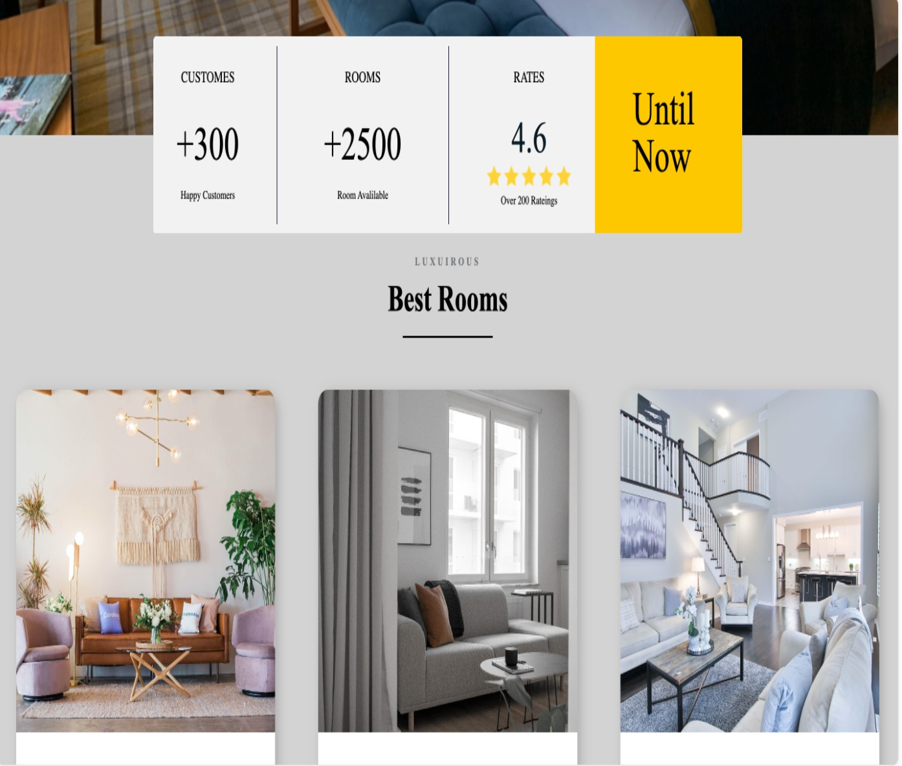
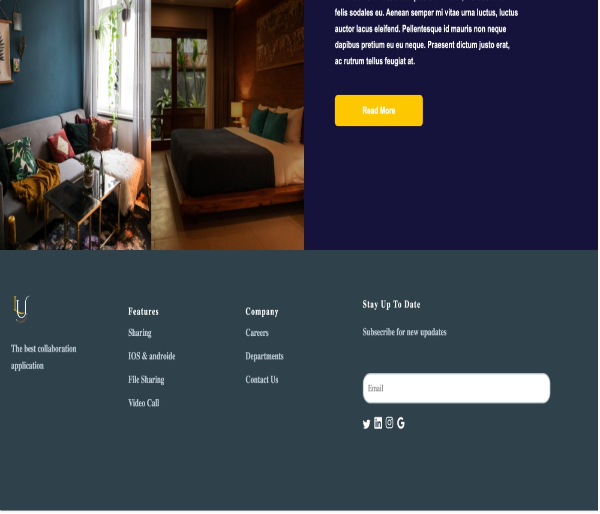
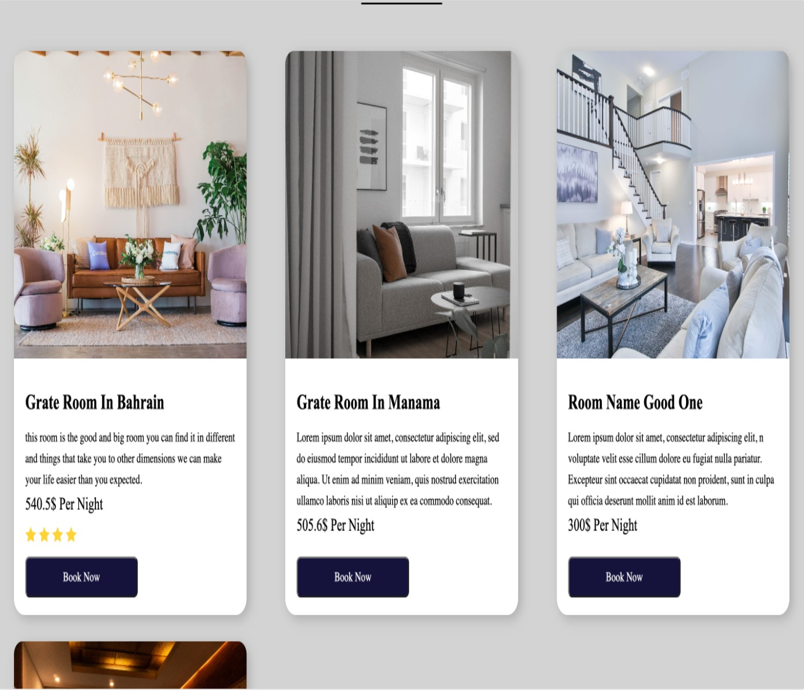
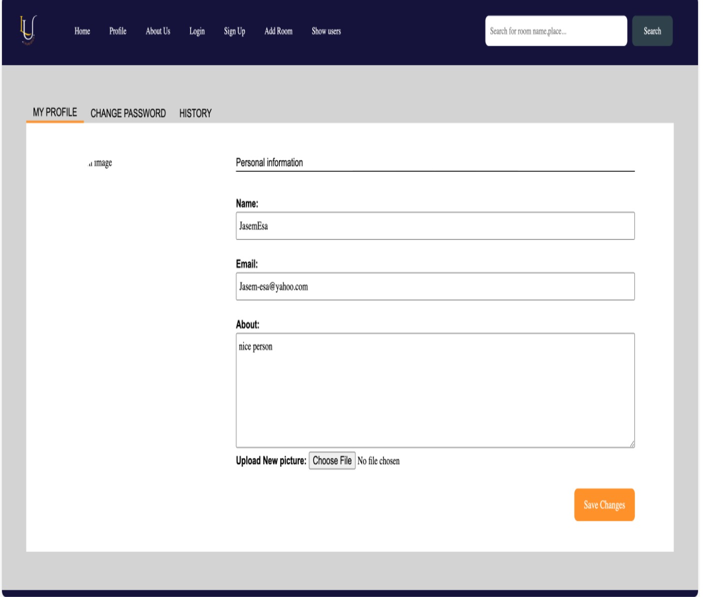
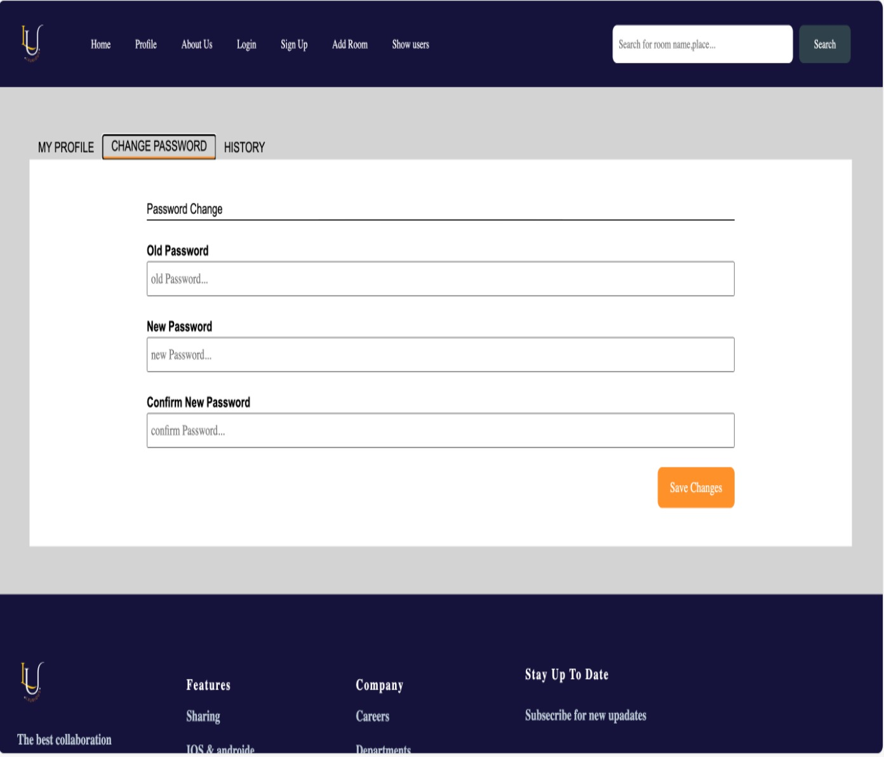
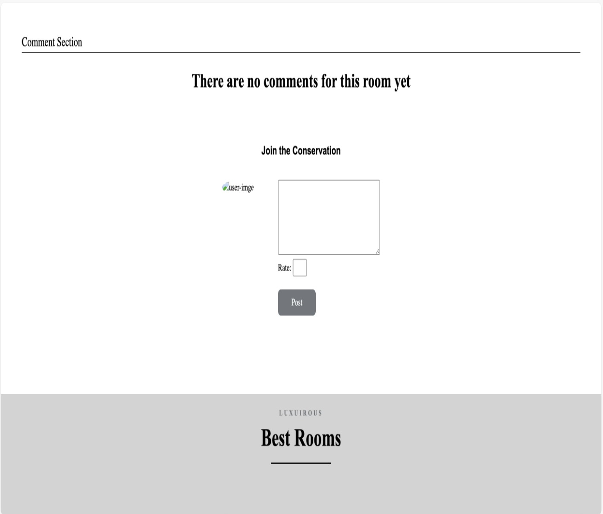
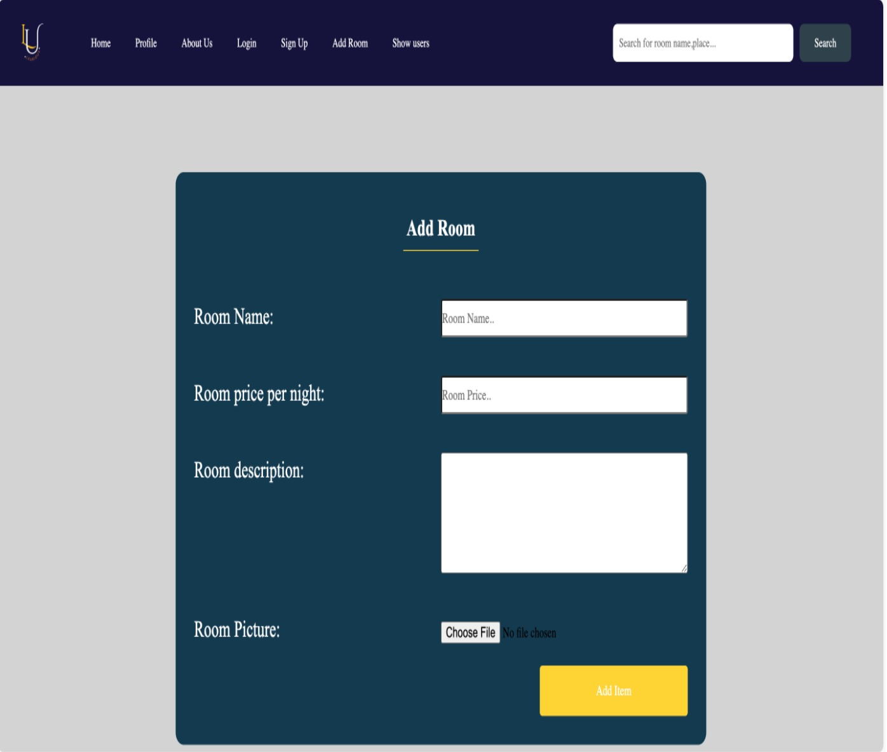
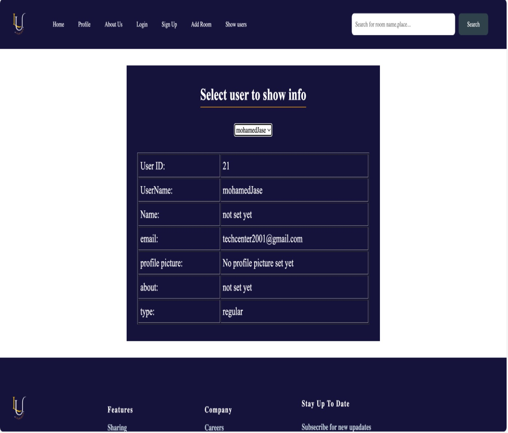

# Elite
<strong> This is an OpenSource Web Application for <a href="http://elite333.us.to">LINK</a> </strong>

  

# Mission Statement
Elite is a newly launched website for booking a luxurious hotel room, developed as *Free and Open-Source Software*. Our goal is to serve individuals who are looking for the ultimate in luxury travel experiences by offering a simple and easy-to-use booking platform. Our dedication is in our selection of exceptional hotels and resorts that provide guests with an unmatched degree of magnificence and luxury. Elite aims to be the preferred option for people looking for a classy and elegant stay, providing our wealthy guests with an easy and elegant reservation experience.

# Table of Contents
1. [The project is Free And Open-Source](#the-project-is-free-and-open-source)
2. [Looking around Other Similar Projects](#Looking-around-Other-Similar-Projects)
3. [Choosing a Good Name](#choosing-a-good-name)
4. [Starting from What You Have](#Starting-from-What-You-Have)
5. [Features and Requirements List](#features-and-requirements-list)
6. [Development Status](#development-status)
7. [Downloads](#Downloads)
8. [Version Control and Bug Tracker Access](#Version-Control-and-Bug-Tracker-Access)
9. [Communication Channels](#communication-channels)
10. [Developer Guidelines](#developer-guidelines)
11. [Documentation](#documentation)
12. [Frequently Asked Questions (FAQ)](#frequently-asked-questions-faq)
13. [Developer Documentation](#developer-documentation)
14. [Codes of Conduct](#code-of-conduct)
15. [Change Log](#Change-Log)
16. [Screenshots](#Screenshots)
17. [Hosting](#Hosting)
18. [Announcing](#announcements)
19. [License](#License)

# The project is Free And Open-Source
Elite is an open-source platform tailored for luxury hotel room reservations, providing an inclusive space for users to effortlessly discover and book premium accommodations. Our system operates under the MIT License, emphasizing transparency and accessibility. Elite invites everyone to indulge in the world of opulence by designing their own bespoke stays at some of the finest hotels. Whether you're a traveler seeking exclusive experiences or a hotelier looking to showcase your luxury offerings, Elite is the collaborative hub for elevated hospitality.

# Looking around Other Similar Projects
We conducted our own research to identify projects that were comparable to and competitive with ours before launching an open-source project. Here are links to some comparable websites:
https://github.com/AhmedHussain12345/Hotelbookingwebsite
https://github.com/OurWebProject/hotelwebsite
https://github.com/Allenpatt/hotellbiru
https://github.com/kjy4926/HotelReserve
https://github.com/mohammadaliraei/HotelReserve

Our main goal was to enable users—travelers and hospitality enthusiasts in particular—by offering a smooth platform for finding and reserving opulent lodging all over the world. We wanted to serve a wide range of customers, including business and leisure travellers as well as those looking for unique travel experiences. Our goal was to provide a carefully chosen range of high-end hotels and resorts while simultaneously improving user accessibility and convenience. Our goal was to develop a user-friendly UI and extensive functionality that would make booking easier and improve our users' travel experience in general.

# Choosing a Good Name
One of the challenges we as a team had was coming up with an appropriate name for the open-source project before it was launched. The project name should convey not only its uniqueness but also a general understanding of its purpose. The project name must also be unique from other projects' names and simple to recall.

We collectively agreed to vote on the names LuminaLodge, Elite, CitadelStays, and InsightStay to choose a suitable name. And collectively, we made the decision to go with the name "Elite" because it is short, memorable, and distinctive. We also conducted our own investigation to look through all the repos and discovered that there aren't many results using this name.

# Starting from What You Have
The creators' ambition is reflected in the transformation of the Elite Web Application into an open-source platform that is available to everybody. Elite has evolved significantly from its initial conception as a project for the ITCS 333 Internet and Web Development course. It is now essential to reorganize the coding to guarantee cross-platform compatibility.

# Features and Requirements List

## Features Overview:

• *User-Friendly Booking Platform:* - Provide a user-friendly interface that makes booking simple and easy to navigate.

• *Selection of Exquisite Hotels and Resorts:* Offer a carefully selected range of upscale residences that are known for their opulence and grandeur.

• *Elegant and Stylish Booking Procedure:* - Make sure each stage of the booking procedure exudes elegance and sophistication.

• *Personalized Guest Experience:* - Customize offers and suggestions to each visitor's particular tastes and needs.

• *Transparent Pricing and Policies:* - Give customers access to precise pricing details as well as explicit guidelines about bookings, refunds, and extra services.

• *Secure and Reliable Booking Platform:* - Adhere to industry standards for data protection and implement strong encryption mechanisms.

• *available Customer Support:* - Provide easily available methods for guests to voice questions, grievances, and special requests in a timely manner.

## Requirements:

-	XAMPP Installation Required: Install XAMPP to set up the necessary server environment for hosting the web application.
-	Choice of Text Editor: You may choose any preferred text editor for coding and development purposes. (For instance, Visual Studio Code is recommended.)
-	Bootstrap v5.3 Integration Necessary: Bootstrap v5.3 must be integrated into the project as the CSS Framework to ensure consistent styling and layout across the website.

# Development Status
*Version:* 1.0.0

*Release Date:* February 28,2023

*Project Activity:* Stable release with no recent updates

*Bugs and Issues:* No known bugs, extensively tested for stability. 

*Responsive Design:* Fully responsive for seamless user experience on various devices

*Community Engagement:* Currently limited community engagement and seeking user feedback for future enhancements and addition of new features. 

*Roadmap:* Considering future updates based on user feedback. 

*Documentation:* Documentation is not currently available; contributions in this area would be greatly appreciated. 

This version of "Elite" is a stable release that provides users with a responsive and error-free platform to book fancy hotel rooms. Stability is maintained through ongoing maintenance, and suggestions from users are encouraged for possible improvements in the future. There isn't any documentation accessible right now, so any help in this area would be very appreciated.

# Downloads
To get started with Elite, follow these simple steps:

1. **Download [XAMPP](https://www.apachefriends.org/download.html):**
   Install XAMPP as a prerequisite. Click [here](https://www.apachefriends.org/download.html) to download.

2. **Download [Elite Source File](https://github.com/Fronexe/GeoHub/archive/refs/heads/master.zip):**
   Click [here](https://github.com/Fronexe/GeoHub/archive/refs/heads/master.zip) to download the GeoHub source files.

3. **Download [Visual Studio Code](https://code.visualstudio.com/Download):**
   Choose and install Visual Studio Code or any text editor you prefer. Click [here](https://code.visualstudio.com/Download) to download.

4. **Download [Bootstrap](https://getbootstrap.com/docs/5.3/getting-started/):**
   Elite relies on Bootstrap for frontend design. Click [here](https://getbootstrap.com/docs/5.3/getting-started/) discover Bootstrap.

   Enjoy using Elite locally on your machine!

   # Version Control and Bug Tracker Access
   The development process is made more transparent by using the following version control and bug tracking tools:

   - *Version Control System:* We make extensive use of Git version control to guarantee a seamless collaborative development process. Contributors may now easily communicate, keep track of changes, and preserve a clear project history. You can follow the development of the project by checking [here](https://github.com/MahaAlzoubah/Elite/commits/main).

   - *Bug Tracker:* Please use our [GitHub Issues](https://github.com/MahaAlzoubah/Elite/issues) page to report bugs, make enhancement suggestions, or submit feature requests.

We hope to improve communication, monitor project progress, and quickly resolve problems by employing these technologies. Your input and comments are very important to the ongoing development of the Elite website.

# Communication Channels
We've set up official channels for interaction with our Elite community to facilitate productive conversation and teamwork: 

- *Discussions Board:* Join our GitHub Discussions board to have intelligent discussions, exchange ideas, and report problems. [Elite Discussions](https://github.com/MahaAlzoubah/Elite/discussions)

- *Email:* You can contact us at elite.github@gmail.com with private questions. 

We encourage you to use these channels for submitting comments, questions, and any other inquiries related to Elite. Your feedback is valuable to us!

# Developer Guidelines

Welcome to the community supporting Elite development! The purpose of these guidelines is to facilitate your effective participation in the project. Before you begin working on Elite, please review these a bit. 

### Developers’ Interaction

The documents and guidelines of the community must be followed by every member. 

It is recommended that developers connect via Microsoft Teams or email. 
These are not hard regulations, but rather guidelines. They seek to enhance collaboration, optimise our process, and provide advantages to our goods as well as to individual developers. 

The Elite development team is available for assistance if you have any issues regarding these criteria.

## Code Format

-	There should only be one code command per line. 
-	Keep the space between code blocks at two lines.

## Code Scope

-	Classes that have just default constructor values should use default constructors. 
-	Use the keyword "final" unless it pertains to constants.

## Other Code-Related Information

-	Each variable's name should have meant and be pertinent to its intended use. 
-	There should be a brief statement describing the purpose of each group or block of code.

### Developing Secure Software

Although it might not be the most thrilling aspect of writing code, it is imperative to take security threats into account. Analyzing security risks should start early in the project and continue all the way through to conclusion.

-	Learn about the security threats related to the project's components. 
-	Steers clear of depending just on default configurations and software that comes with the box. 

### Which Programming Language Should I Use?

Regarding programming languages, we don't have any hard regulations. We use JS, CSS, PHP, and HTML now, however we're open to changes for better project outcomes.

### Code Comments

-	Comments on the code should provide an explanation for its actions. 
-	Make sure your indentation is standardized.
-	Make use of the horizontal whitespace (code blocks and paragraphs). 
-	Don't write lines that are longer than 75–80 characters.

## Using the bug Tracker

The recommended method for reporting issues, asking for features, and making pull requests is the bug tracker.

### Feature Requests

-	Make sure the objectives and scope of the project align with your idea.
-	Make a strong argument to argue in favor of the feature.

### Requests for Pulls

-	Good pull requests include patches, upgrades, and new features.
-	Aim for focused pull requests and steer clear of irrelevant commits.
-	Before you begin, find out the scope of the pull request from a maintainer.

### Bug Report

Include:

- Title: Concise and precise. 
- Summary: In-depth justification is provided. 
- Visual evidence: Video or screenshots are provided. 
- Expected versus actual result: succinct and direct. 
- Reproducible steps: Steps that caused the bug. 
- Environment: OS, browser, screen resolution, and zoom degree. 
- Log from the console: Find the source of the issue. 
- URL of the source: To rapidly determine the problem. 
- Priority and severity: The degree of impact and the urgency of the investigation. 
- Name of the reporter, recipient, deadline, and exchange with the customer or user.

Create a report using this data and send it to elite.github@gmail.com for support.

# Documentation

As previously indicated under the development status, the website's complete documentation is currently unavailable because it is still in the early stages of development for an open-source project that is just getting started. On the other hand, you must possess a reasonable level of technical proficiency to contribute to our project, especially in web development and server configuration. Setting up Elite locally using XAMPP entails cloning the repository, configuring Apache and MySQL, and establishing a new database in phpMyAdmin if you're comfortable with version control systems like Git. The config.php file needs to have the database credentials updated. Frontend design is dependent on frameworks like Bootstrap, while navigating and modifying the backend logic requires a little familiarity of PHP. Although the instructions walk you through the procedure, exploring and modifying Elite's frontend will be simpler for users who have some familiarity with JavaScript, HTML, PHP, and CSS (particularly Bootstrap). In general, users will find it easier to traverse the setup and customization if they have a basic familiarity of web programming fundamentals.

# Frequently Asked Questions (FAQ)

### 1. What is Elite?

Elite is a web application that allows you to make luxurious, exclusive hotel reservations to elevate your trip. With Elite, you may enjoy flawless reservations, carefully chosen luxury, and ultimate elegance.

### 2. How can I use Elite?

Simply visit the [GeoHub Website] to get the hosted version of Elite. If you wish to contribute or explore the code, visit the [GitHub Repository](https://github.com/MahaAlzoubah/Elite).

## 3. Is Elite free to use?

Yes, Elite is completely free to use and open source for all users.

## 4. I have a suggestion or found a bug. Where can I share it?

Please share your comments or report issues on our [Issues page](https://github.com/MahaAlzoubah/Elite/issues). We value your input!

## 5. How can I stay updated on Elite's progress?

Follow us on [GitHub](https://github.com/MahaAlzoubah/Elite) for updates. You can also join our community discussions on [Discussions](https://github.com/MahaAlzoubah/Elite/discussions) for announcements and news.

# Developer Documentation

## Overview
Welcome to Elite's developer docs! This section provides a comprehensive overview of our web application's codebase and how to contribute to it. PHP is the main programming language used on our hotel booking website; JavaScript, HTML, and CSS are also used. We make use of the Bootstrap framework to improve styling and guarantee cross-device responsiveness.

## Table of Contents

1. [Getting Started](#getting-started)
2. [Dependencies](#dependencies)
3. [Backend (PHP)](#backend)
4. [Frontend (JavaScript, HTML, CSS)](#frontend)

## Getting Started

To set up Elite locally using XAMPP, follow these steps:

1. Use git clone https://github.com/MahaAlzoubah/Elite.git` to clone the repository.
2. Transfer the project folder to the htdocs directory of XAMPP. 
3. Launch XAMPP and make sure MySQL and Apache are up and working. 
4. In phpMyAdmin, create a new database. 
5. Update the config.php file with your database credentials to configure the database. 
6. Open your browser and go to https://github.com/MahaAlzoubah/Elite 

## Dependencies

The following are the main dependencies on which Elite depends:

- *Bootstrap*: A responsive and mobile-first design is guaranteed by this front-end framework. See the composer.json file for a full list of dependencies.

## Backend

### PHP

PHP is mostly used for the backend logic. Important files and directories to be mindful of consist of: 

- Models - Controllers - Database communication 

## Frontend

### JavaScript, HTML, CSS (Bootstrap)

HTML provides structure, CSS with Bootstrap styling, and JavaScript for interactivity in the frontend components. Important files and folders consist of: 

JavaScript scripts for front-end functions 
- User interface element HTML templates 
- Bootstrap integration with CSS files for style and responsive design. 

For developers looking to comprehend, improve, and add to the functionality and performance of Elite Website, this documentation offers an extensive resource. 

# Code of Conduct

## Elite Code of Conduct

### Overview

We, the project's contributors, and maintainers, promise to respect everyone who participates by filing bug reports, making feature requests, adding to the documentation, pulling requests, and other actions. 

Regardless of experience level, gender, gender identity and expression, handicap, physical appearance, body size, color, ethnicity, age, religion, or nationality, we are dedicated to ensuring that everyone involved in this project is free from harassment.

## Our Standards

### Some Examples of behavior that contributes to creating a positive environment include:

Focusing on what is best for the community, being respectful of others' perspectives and experiences, accepting constructive criticism with grace, speaking in a kind and inclusive manner, and empathetically relating to other community members.

### Some Examples of unacceptable behavior by participants include:

Insults, disparaging remarks, and political or personal assaults Harassment in public or private; disclosing another person's personal information—like their physical or email address—without their consent; and engaging in any other behavior that would be deemed improper in a work environment.

## Responsibilities of Contributors

The right and obligation to remove, edit, or reject comments, commits, code, wiki edits, issues, and other contributions that do not adhere to this code of conduct rests with the project maintainers. They also have the authority to ban any contributor temporarily or permanently for any other behaviors that they consider to be improper, threatening, offensive, or harmful. 

## Scope

When someone is speaking on behalf of the project or its community in public, they are bound by this code of conduct. Using an official project email address, publishing content on an official social media account, or serving as a designated representative at an online or offline event are a few instances of representing a project or community.

## Enforcement

Reporting abusive, harassing, or otherwise inappropriate behavior can be done by sending an email to elite.github@gmail.com, the project team. All concerns will be examined and investigated by the project team, which will then take the appropriate action given the situation. The project team has a duty to keep the identity of the incident reported discreet.

## Attribution

This Code of Conduct is adapted from the [Contributor Covenant](https://www.contributor-covenant.org), version 2.0, available at [https://www.contributor-covenant.org/version/2/0/code_of_conduct.html](https://www.contributor-covenant.org/version/2/0/code_of_conduct.html).

# Change Log
All significant changes to the Elite project will be documented in this file. The format adheres to the principles of Keep a Changelog, and the project follows Semantic Versioning.
##[1.0.0] - 2024-02-01
###Added
- Added a blog section for sharing community insights and updates.
- Introduced a new user dashboard with personalized settings.
- Integrated social media sharing options for articles and pages.
###Changed
- Reorganized the project's folder structure for better code organization.
- Upgraded the server infrastructure to improve website performance.
- Changed the default color scheme to a more modern and vibrant palette.
Contributors for this release: <a href="http://twitter/MahaAlzouba">@MahaAlzouba</a>, <a href="http://twitter/NoorJafaar">@NoorJafaar</a>, <a href="http://twitter/FatemaSalman">@FatemaSalman</a>.
##[0.9.0] - 2023-12-15
###Fixed
- Fixed a critical security vulnerability related to user authentication.
- Resolved issues causing intermittent downtime during high traffic periods.
- Fixed broken image links on certain pages.
Contributors for this release: <a href="http://twitter/MahaAlzouba">@MahaAlzouba</a>, <a href="http://twitter/NoorJafaar">@NoorJafaar</a>.
##[0.8.1] - 2023-11-28
###Changed
- Improved error handling for a more user-friendly experience.
- Updated third-party libraries to the latest versions for security patches.
- Changed the contact form layout for better usability.
###Fixed
- Fixed broken links in the documentation section.
- Addressed cross-browser compatibility issues with Internet Explorer.
- Fixed alignment problems on the mobile version of the site.
Contributors for this release: <a href="http://twitter/MahaAlzouba">@MahaAlzouba</a>, <a href="http://twitter/NoorJafaar">@NoorJafaar</a>, <a href="http://twitter/FatemaSalman">@FatemaSalman</a>.

# Screenshots
Found below are screenshots of the demo website that is hosted:

## Sign In Page

  

## Sign Up Page

  

## Main Page

  

## Contributer Rate 

  

## Rooms

  

## Discover Page

  

## Information 

  

## Profile Page

  

## Room Details Page

  

## Comment Page

  

## Change Password Page

  

## Reservation Details Page

  

## History Page

  

## Add Room Page

  

## User Info Page

  

# Hosting

We had our own virtual private server (VPS) hosted on the cloud (Digital Ocean) and running our website using Apache and MySQL and the following link can be used to access the demo website:
[here](http://elite333.us.to)

# Announcements

Exciting news, Elite Announcing! Advertising is now available! Stay updated [here](https://github.com/MahaAlzoubah/Ellite/discussions/categories/announcements). Let's make Elite better!

The Elite Team

# License

MIT License

Copyright (c) 2024 Elite

Permission is hereby granted, free of charge, to any person obtaining a copy
of this software and associated documentation files (the "Software"), to deal
in the Software without restriction, including without limitation the rights
to use, copy, modify, merge, publish, distribute, sublicense, and/or sell
copies of the Software, and to permit persons to whom the Software is
furnished to do so, subject to the following conditions:

The above copyright notice and this permission notice shall be included in all
copies or substantial portions of the Software.

THE SOFTWARE IS PROVIDED "AS IS", WITHOUT WARRANTY OF ANY KIND, EXPRESS OR
IMPLIED, INCLUDING BUT NOT LIMITED TO THE WARRANTIES OF MERCHANTABILITY,
FITNESS FOR A PARTICULAR PURPOSE AND NONINFRINGEMENT. IN NO EVENT SHALL THE
AUTHORS OR COPYRIGHT HOLDERS BE LIABLE FOR ANY CLAIM, DAMAGES OR OTHER
LIABILITY, WHETHER IN AN ACTION OF CONTRACT, TORT OR OTHERWISE, ARISING FROM,
OUT OF OR IN CONNECTION WITH THE SOFTWARE OR THE USE OR OTHER DEALINGS IN THE
SOFTWARE.
